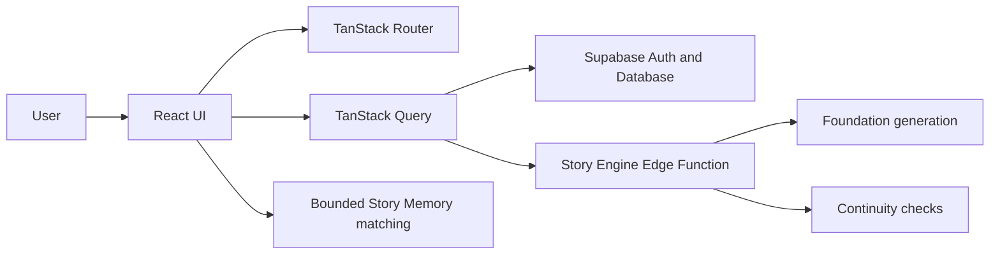

# ONESHOT AI

## Build stories that remember.

ONESHOT AI turns a single idea into a structured, evolving story universe. It helps writers build a Story Foundation, draft chapters, organize canon in a Story Bible, review supported consistency findings, ask evidence-bounded Story Memory questions, and manage recorded story events without losing narrative context.

## What ONESHOT solves

Long-form fiction scatters important facts across notes, drafts, character documents, and timelines. ONESHOT keeps those records together so writers can return to the story, understand what is established, and decide what to work on next.

## Core workflow

`Premise → Story Foundation → Story Bible → Writing Workspace → Story Consistency → Story Memory → Story Timeline`

- **Create Story** collects a premise and supported creative details.
- **Story Foundation** generates proposed story records for review.
- **Story Bible** organizes characters, locations, organizations, objects, rules, and events.
- **Writing Workspace** provides chapter editing, debounced autosave, revision checkpoints, read-aloud, focus mode, and continuity access.
- **Story Consistency** compares a saved chapter with available approved/project story information and presents evidence-backed findings.
- **Story Memory** answers questions using bounded keyword evidence from saved project records; it is not semantic search.
- **Story Timeline** presents and manages the event/timeline records supported by the current application.

## Product preview

Real authenticated screenshots are not included yet. Browser screenshot capture requires an authenticated local session and a browser automation/runtime setup that is not available in the current shell. Stitch reference images are intentionally not presented as implemented-product screenshots.

## Core features

- Editorial landing, authentication, and story dashboard
- Four-step story creation flow
- Foundation generation with staged progress and proposed records
- Story Bible overview, Characters, and World Knowledge views
- Three-panel writing workspace with content editing and autosave
- Save/checkpoint state feedback and read-aloud support
- Story Consistency scan, evidence disclosure, Resolve, and Dismiss actions
- Story Memory question input, evidence responses, unsupported-answer state, and per-story local history
- Story Timeline records, branches, events, canon states, and supported CRUD
- Revision/checkpoint listing in Versions
- Narrative Intelligence observations based on available project records

## Technology

- React 19 + TypeScript
- TanStack Start, Router, and Query
- Vite
- Tailwind CSS v4 and shadcn/Radix UI primitives
- Supabase Auth, Postgres, Row Level Security, and Edge Functions
- Deno Edge Function tests and Node test runner repository tests

Framer Motion is not installed. Current motion uses CSS tokens and reduced-motion rules.

## Architecture



## Project structure

```text
src/routes/                 TanStack route screens
src/components/             Product components and UI primitives
src/lib/                    Auth, queries, types, Story Engine client
src/integrations/supabase/  Supabase client and generated database types
supabase/functions/         Edge Functions and shared validation/security
supabase/migrations/        Database migrations
supabase/tests/             pgTAP database tests
tests/                      Repository and integration tests
docs/                       Phase reports and migration documentation
```

## Local setup

1. Install Node dependencies:

   ```bash
   npm install
   ```

2. Copy `.env.example` to a local ignored environment file and fill placeholder values. Browser variables are `VITE_SUPABASE_URL` and `VITE_SUPABASE_ANON_KEY`; server/Edge Function variables must never be exposed through `VITE_*`.

3. Start the local Supabase stack when backend verification is needed:

   ```bash
   npx supabase start
   ```

4. Start the application:

   ```bash
   npm run dev
   ```

## Available scripts

```bash
npm run dev
npm run typecheck
npm test
npm run lint
npm run build
```

Backend verification commands and environment guidance are documented in [docs/phase1-backend.md](docs/phase1-backend.md) and [docs/phase1-verification.md](docs/phase1-verification.md).

## Database setup

The local Supabase project applies migrations from `supabase/migrations`. Phase 1 migrations define the project, story, revision, generation, and continuity data model with RLS and security-definer helpers. Use `npx supabase db reset` only against the local development stack.

## Testing

The repository test command currently runs 3 Node tests covering RLS/schema contract assertions and atomic project/revision invariants. The project also contains Supabase pgTAP tests, Deno shared-function tests, and an Edge Function integration suite used during local backend verification. Broader automated browser/component coverage remains recommended.

## Accessibility

The application includes skip navigation, visible focus rings, semantic form labels, keyboard interactions, active filter semantics, live save/scan/generation states, accessible contentEditable labeling, responsive panels, and reduced-motion CSS behavior. Browser screen-reader and multi-viewport smoke verification remains environment-dependent.

## Product limitations

- Story Memory uses bounded keyword matching over available project records; it does not use embeddings, semantic retrieval, or graph reasoning.
- Continuity findings are limited to the current scan pipeline and available saved evidence.
- Automatic continuity fixes, AI rewriting, collaboration, publishing/export, billing, and multimedia workflows are not implemented.
- Rich-text formatting controls are not implemented in the manuscript editor.
- Automated test coverage is meaningful for core backend contracts but remains limited for full browser workflows.

## Roadmap

Future work may include richer retrieval, deeper narrative relationship analysis, expanded browser/component tests, collaboration, publishing/export, and optional richer motion. These are not current product capabilities.

## Contributing

Keep changes scoped to the requested product behavior, preserve Supabase contracts and generated types, add tests for mutations and state transitions, and run typecheck, tests, lint, and build before opening a change.

## License

No license has been specified yet.
